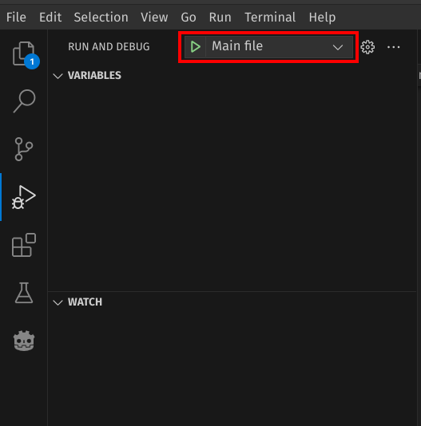

# Sysmic Robotics Engine Robocup SSL

This project consists of two parts. The first part is the engine, which consists of the main program used to control the robots. On the other hand, the second part is a graphical interface intended to accelerate the development (debugging and testing) of the engine.

## 1 Requirements

For the development of this project the following requirements are needed 

### 1.1 Linux SO

This project uses Linux for development, preferably Pop!_OS.

Pop!_OS installation guide:

https://www.youtube.com/watch?v=eol5O1qfWNs

### 1.2 Grsim

For this project we use grsim simulator, and it can be installed from the following link:

https://github.com/RoboCup-SSL/grSim

### 1.3 Vscode

For the code development we strongly recommend use Vscode code editor. The settings to run the engine program and GUI program are located in the .vscode folder.

## 2 Engine installation

Setting the virtual environment
```
cd python-engine
python3 -m venv engine-env
source engine-env/bin/activate
pip install -r requirements.txt
```

### 2.1 Running python engine

Now on the python-engine folder, with the env activaded and the grsim open, run this command:

```python3 main.py```

Or, go to the 'Run and Debug' section in VSCode and select the 'Main File' option.




## 3 GUI installation

### 3.1 Requirements

The GUI depends of the following libraries:

- [CMake](https://cmake.org/)

- [Google protbuf](https://github.com/protocolbuffers/protobuf)

Most of these libraries are already installed if you have successfully run GrSim. 

### 3.2 Compilation

```
cd algo_commander
mkdir build
cd build
cmake ..
```

### 3.3 Running the GUI

Inside build folder, run this:

```
./src/algo_commander
```


