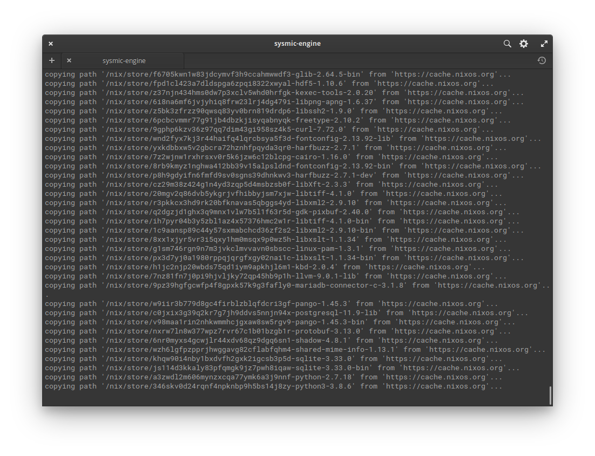
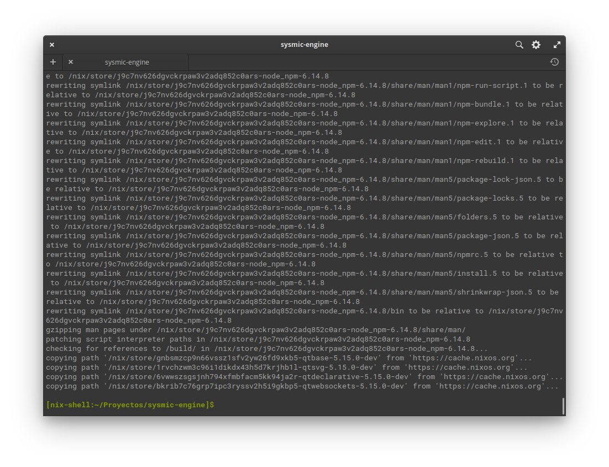
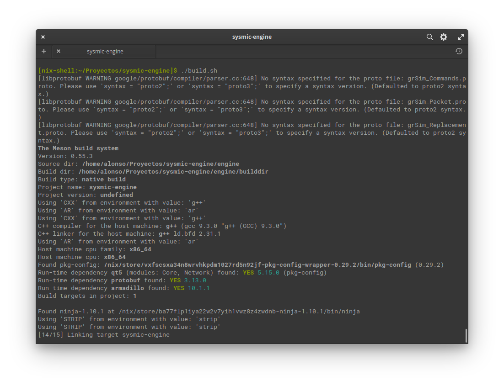

# Getting Started

This is a small guide to help people get started with the Sysmic Engine.

## Project

It's consist of two programs, one being the engine and the other being a user interface. Both programs communicate over sockets.

### Engine

The engine is written on C++ and the UI on Node.js. Some things it would help to know to be able to work on the engine:

- Using the Linux terminal and navigating between directories.
- Understanding how to use a build system. In this case we are using [Meson](https://mesonbuild.com/).
- Understanding git basics.

#### Project Structure

```
engine/
    src/           Contains the source code of the engine.
        main.cpp       Entry point of the program.
    include/       Contains the header files of the engine.
    protobuf/      Contains message definitions, they specify the format of data sended or received via sockets.
    build.sh       A script with the instructions to build the engine. It also compiles the protobuf files.
    meson.build    Meson configuration file.
ui/
    components/    HTML components created for the UI
    css/           Styling
    js/
        communication.js    Communication with the engine
        data.js             Global variables used accross the UI
    protobuf/
    build.sh       A script that compiles the protobuf files and install de ui dependencies
    index.html     Main html file of the UI
    main.js        Entry point of the UI
    packages.json  Dependencies and meta data of the UI
default.nix    Defines a build environment with the packages that the project needs
```

#### Program Structure

## Installing dependencies

The Sysmic Engine uses nix for installing dependencies. This makes easy to install the dependencies of the project and makes sure that we all are working on the same project.

To install nix you can head over their installation [page](https://nixos.org/download.html#nix-quick-install). If you are able to install Nix you shouldn't have problem installing the rest of the dependencies.

Then for installing the dependencies and creating the environment run on the program directory:
```
nix-shell
```

You should see something like this:



After the installation you shoul be on a nix-shell with the dependencies needed for the project:



## Building

After entering the nix-shell you can build the Project (the engine and the ui) with
the script build.sh.



This script:
1. Compile protobuf files in engine.
2. And then builds the project using meson.
3. Compile protobuf file in ui.
4. Install ui dependencies using `npm install`.
