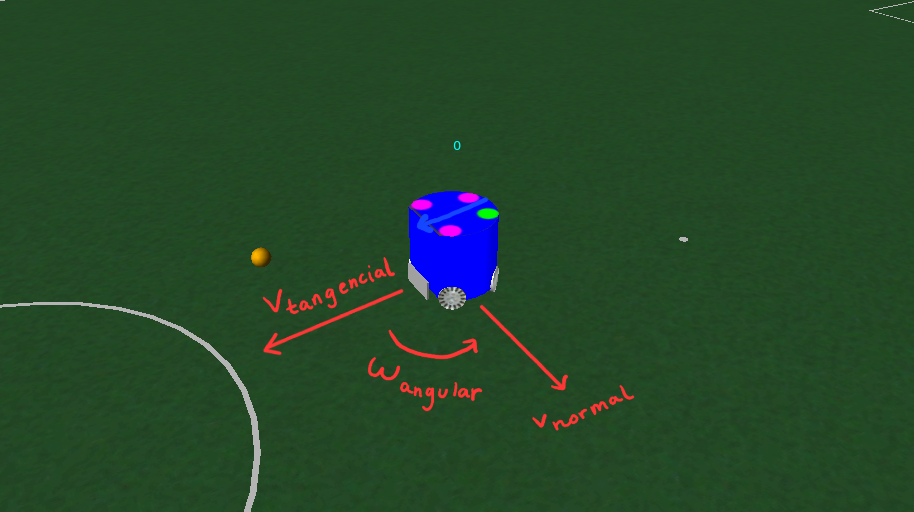

# Comandos GrSim

Esta pequeña guía indicará los comandos que se utilizan en el GrSim para el movimiento del robot.

La comunicación hacia grSim está dado por la clase Vision, por medio de la función `communicate_grsim()` que acepta solamente parámetros opciones, pero hay dos que deben ir incluídos obligatoriamente para el correcto funcionamiento de esta:

1. `id`: Es la id del robot en cuestión. Para efectos de la liga SSL, va de la id 0 hasta la id 5.

2. `isteamyellow`: Es un booleano que indicará si el robot pertenece al equipo amarillo (con valor 1, que equivale a True) o al equipo azul (con valor 0, que equivale a False).

Así, hay una serie de valores opciones que indicarán la acción que realizará el robot:

* `velangular`: Permite al robot rotar. Los valores positivos harán que rote de forma antihoraria, y los valores negativos que rote de forma horaria.

* `kickspeedx`: Define la 'fuerza' del pateo horizontal. Lo lógico son únicamente los valores positivos, ya que mientras más valor haya, más fuerte será el pateo.

* `kickspeedz`: Es la 'fuerza' del pateo vertical. No está implementado en nuestros robots, se desaconseja su uso.

* `veltangent`: Es la velocidad a cual el robot se desplaza. El sentido está dada por la 'cara' del robot. Una velocidad negativa hará que el robot se desplace hacia atrás.

* `velnormal`: Es la velocidad perpendicular a la velocidad tangencial en el plano xy. Los valores positivos están orientados hacía la izquierda del robot, los valores negativos hacia su derecha.

La siguiente imagen resume estas tres principales velocidades. El robot está orientado hacia la velocidad tangencial.

* `spinner`: Permite activar el spinner con un 1. Esto permite al robot tener posesión de la pelota y moverse libremente.

* `whelsspeed`: Ni idea

